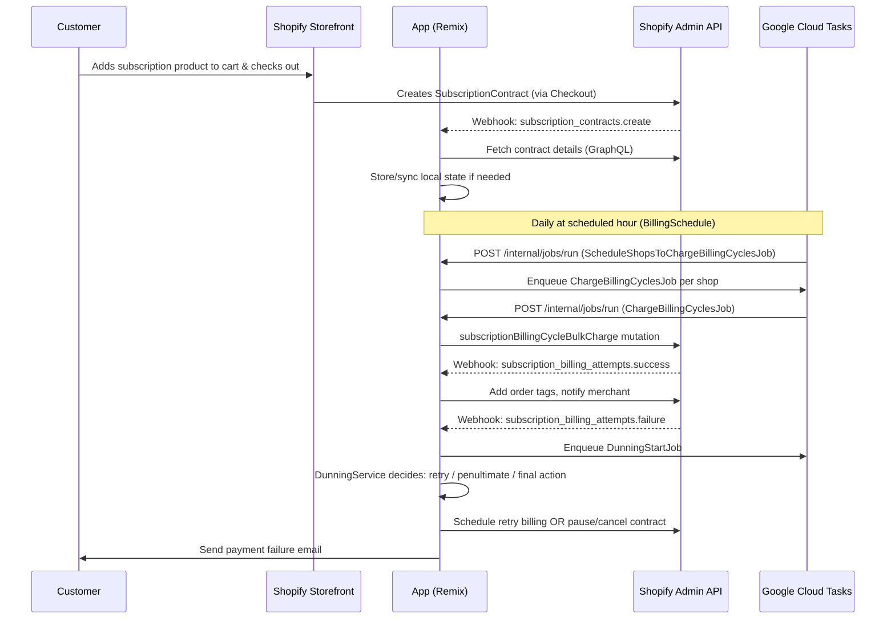

# Shopify Subscriptions Reference App — Developer Walkthrough

> A practical onboarding guide for new developers who will be modifying this codebase.

---

## 1. High-Level Overview

This is a **Shopify Embedded App** that enables merchants to offer recurring subscription products. Built as a reference implementation by Shopify, it demonstrates first-party subscription APIs including:

- Creating and managing **Selling Plans** (subscription intervals and pricing)
- Processing **recurring billing cycles** automatically
- Handling **payment failures** through a dunning (retry) system
- Letting customers manage their own subscriptions via a storefront UI extension
- Notifying merchants and customers by email on key events

**What it is NOT**: It is not a payment processor or a standalone SaaS. All actual billing happens inside Shopify via its Subscription Contracts API. This app orchestrates *when* and *how* to call that API.

---

## 2. End-to-End System Flow

Here is the complete journey from a customer subscribing to recurring charges happening:



---

## 3. Architecture Explanation

The app is structured in distinct layers:

| Layer | Technology | Purpose |
|---|---|---|
| **Hosting / Runtime** | Remix (React framework) on Node.js | Handles HTTP, SSR, routing |
| **Admin UI** | React + Shopify Polaris | Merchant-facing dashboard embedded in Shopify Admin |
| **Storefront Extensions** | Shopify UI Extensions (React) | Customer-facing subscription management widgets |
| **Background Jobs** | Google Cloud Tasks (prod) / Inline (dev) | Async, scheduled work like billing runs |
| **Shopify API** | GraphQL Admin API (Unstable) | All subscription data lives in Shopify, not locally |
| **Database (local)** | PostgreSQL via Prisma | Only stores: OAuth sessions, billing schedule, dunning state |
| **Email** | Shopify Customer/Merchant Email API | Sends billing failure / payment update emails |

> [!IMPORTANT]
> **The app does NOT own subscription data.** Everything — contracts, billing cycles, selling plans — lives in Shopify. The local DB only stores three things: OAuth sessions, per-shop billing schedule config, and dunning retry tracking.

---

## 4. Folder Structure

```
subscriptions-reference-app/
├── app/                        ← Main Remix application
│   ├── routes/                 ← URL handlers (loaders + actions)
│   │   ├── app._index/         ← Contracts list page
│   │   ├── app.contracts.$id.*/← All contract management pages
│   │   ├── app.plans.*/        ← Selling plan management
│   │   ├── webhooks.*/         ← Shopify webhook receivers
│   │   └── internal.jobs.run.tsx ← Job execution endpoint (Cloud Tasks callback)
│   ├── services/               ← Business logic classes
│   │   ├── DunningService.ts   ← Orchestrates billing failure handling
│   │   ├── FinalAttemptDunningService.ts  ← Last retry: cancel/pause
│   │   ├── PenultimateAttemptDunningService.ts ← Second-to-last retry
│   │   ├── RetryDunningService.ts          ← Normal retry
│   │   ├── InventoryService.ts             ← Stock reservation on billing
│   │   └── AfterAuthService.ts             ← Post-install setup
│   ├── jobs/                   ← Concrete job classes
│   │   ├── billing/            ← Billing cycle jobs
│   │   └── dunning/            ← Dunning (retry) jobs
│   ├── lib/jobs/               ← Job runner infrastructure
│   │   ├── Job.ts              ← Base class all jobs extend
│   │   ├── JobRunner.ts        ← Registers and dispatches jobs
│   │   └── schedulers/         ← Inline, Cloud Task, TestScheduler
│   ├── models/                 ← Data-access layer (Prisma + Shopify GraphQL)
│   │   ├── SubscriptionContract/
│   │   ├── BillingSchedule/
│   │   ├── DunningTracker/
│   │   ├── Settings/           ← Stored as Shopify Metaobjects
│   │   └── SellingPlan/
│   ├── graphql/                ← All raw GraphQL queries/mutations (~53 files)
│   ├── shopify.server.ts       ← Shopify app SDK initialization
│   └── db.server.ts            ← Prisma client singleton
├── extensions/                 ← Shopify UI Extensions
│   ├── buyer-subscriptions/    ← Customer portal (manage subscriptions)
│   ├── admin-subs-action/      ← Admin action panel on orders
│   ├── subscription-admin-link/← Admin order link to subscription
│   ├── thank-you-page/         ← Post-checkout subscription confirmation
│   ├── theme-extension/        ← Storefront theme blocks
│   └── pos-extension/          ← Point of Sale integration
├── prisma/
│   ├── schema.prisma           ← Database schema (3 models)
│   └── migrations/             ← Migration history
├── shopify.app.toml            ← App configuration (scopes, extensions)
└── package.json
```

---

## 5. Key Modules and How They Interact

### Job Pipeline (Billing)

```
[CRON trigger via Cloud Tasks]
    ↓
ScheduleShopsToChargeBillingCyclesJob
    - queries all shops with active BillingSchedule in local DB
    - enqueues one ChargeBillingCyclesJob per shop
    ↓
ChargeBillingCyclesJob
    - calls subscriptionBillingCycleBulkCharge (Shopify bulk mutation)
    - Shopify then attempts billing for all due cycles
    ↓
[Shopify processes billing]
    ↓
Webhook: subscription_billing_attempts.success OR .failure
```

### Job Pipeline (Dunning)

```
Webhook: billing_attempts.failure
    ↓
DunningStartJob (enqueued via Cloud Tasks)
    ↓
DunningService.run()
    ├── Guard: is billing attempt ready? (skip if not)
    ├── Guard: is cycle already billed? (mark complete)
    ├── Guard: is contract cancelled/expired? (mark complete)
    ├── RETRY_DUNNING → RetryDunningService (schedule next attempt)
    ├── PENULTIMATE_ATTEMPT → PenultimateAttemptDunningService
    └── FINAL_ATTEMPT → FinalAttemptDunningService (cancel/pause + email)
```

### Settings (Metaobjects)

App settings (retry attempts, days between retries, failure behavior) are stored as **Shopify Metaobjects**, not in the local database. This is a deliberate decision — it keeps settings merchant-specific and accessible via the Shopify Admin without a separate API.

---

## 6. Important APIs and Their Responsibilities

### Admin Routes (Remix Loaders/Actions)

| Route | Method | Purpose |
|---|---|---|
| `app._index` | GET | List all subscription contracts |
| `app.contracts.$id._index` | GET | View a single contract's details + billing cycles |
| `app.contracts.$id.bill-contract` | POST | Manually trigger a billing attempt |
| `app.contracts.$id.cancel` | POST | Cancel a subscription contract |
| `app.contracts.$id.pause` | POST | Pause a subscription |
| `app.contracts.$id.resume` | POST | Resume a paused subscription |
| `app.contracts.$id.edit` | GET/POST | Edit products, quantities, discounts |
| `app.contracts.$id.payment-update` | POST | Send customer a payment method update email |
| `app.contracts.$id.billing-cycle-skip` | POST | Skip a specific billing cycle |
| `app.plans._index` | GET | List selling plans |
| `app.plans.$id` | GET/POST | Edit a selling plan group |
| `app.settings._index` | GET/POST | View/update dunning settings |

### Webhook Endpoints

| Route | Shopify Event | Action |
|---|---|---|
| `webhooks.subscription_contracts.create` | Contract created | Log, sync |
| `webhooks.subscription_contracts.cancel` | Contract cancelled | Mark dunning complete |
| `webhooks.subscription_billing_attempts.success` | Billing succeeded | Add order tags |
| `webhooks.subscription_billing_attempts.failure` | Billing failed | Enqueue DunningStartJob |
| `webhooks.subscription_billing_cycles.skip` | Cycle skipped | Notify customer |
| `webhooks.selling_plan_groups.create_or_update` | Plan updated | Sync translations |
| `webhooks.app.uninstalled` | App removed | Clean up shop data |

### Internal API

| Route | Used By | Purpose |
|---|---|---|
| `POST /internal/jobs/run` | Google Cloud Tasks | Execute a job payload |
| `GET /services/ping` | Health checks | Returns 200 OK |

---

## 7. Database Structure and Relationships

The local Postgres database (via Prisma) has only **3 models**:

```prisma
model Session {
  id          String    @id
  shop        String             // e.g. "mystore.myshopify.com"
  accessToken String             // OAuth token for API calls
  // ...standard Shopify session fields
}

model BillingSchedule {
  id        Int      @id
  shop      String   @unique     // One schedule per shop
  hour      Int      @default(10)// What hour (UTC) to run billing (e.g. 10 = 10am)
  timezone  String   @default("America/Toronto")
  active    Boolean  @default(true)
  // Set automatically on install via AfterAuthService
}

model DunningTracker {
  id                Int       @id
  shop              String
  contractId        String    // Shopify GID, e.g. gid://shopify/SubscriptionContract/123
  billingCycleIndex Int       // Which cycle failed (0-based)
  failureReason     String    // e.g. "PAYMENT_DECLINED"
  completedAt       DateTime? // null = dunning in progress
  completedReason   String?   // e.g. "BILLING_CYCLE_ALREADY_BILLED"
  
  @@unique([shop, contractId, billingCycleIndex, failureReason])
}
```

> [!NOTE]
> `DunningTracker` is the app's memory of "we are currently retrying this failed cycle." When dunning concludes (success, final cancel, or skip), it marks `completedAt`. This prevents running multiple dunning flows for the same failure.

---

## 8. External Integrations

### Shopify Admin GraphQL API
- Used for **everything** subscription-related: reading contracts, billing cycles, selling plans, sending emails.
- API version: `Unstable` (see [shopify.server.ts](file:///Users/soumavadas/Documents/subscriptions-reference-app/app/shopify.server.ts)). This means breaking changes can happen — pin carefully.
- Auth: OAuth tokens stored in `Session` table.

### Shopify Metaobjects (Settings storage)
- App settings are stored as Shopify Metaobjects of type `$app:settings`.
- Created automatically on first install via `AfterAuthService → ensureSettingsMetaobjectDefinitionAndObjectExists`.
- Settings include: `retryAttempts`, `daysBetweenRetryAttempts`, `onFailure` (PAUSE/CANCEL/NOTHING).

### Shopify Webhooks
- Registered in [shopify.app.toml](file:///Users/soumavadas/Documents/subscriptions-reference-app/shopify.app.toml).
- All webhook routes are under `app/routes/webhooks.*.tsx`.
- Shopify signs webhook payloads — `authenticate.webhook(request)` verifies the signature automatically.

### Google Cloud Tasks (Production Job Scheduler)
- Background jobs are dispatched to Cloud Tasks in production.
- Cloud Tasks calls back to `POST /internal/jobs/run` with the serialized job payload.
- In local development, `InlineScheduler` runs jobs synchronously (no Cloud Tasks needed).

### Customer Emails (Shopify API)
- `CustomerSendEmailService` calls `customerPaymentMethodSendUpdateEmail` mutation.
- `MerchantSendEmailService` sends templated emails to merchants via Shopify's email infrastructure.

### i18n (Internationalization)
- Uses `i18next` + `remix-i18next`.
- Translation files live in `app/i18n/`.
- Selling plan translations are stored in Shopify via `TranslationsRegisterMutation`.

---

## 9. Running the Project Locally

### Prerequisites
- Node.js 18+, pnpm, Shopify CLI, a Shopify Partner account
- A development store with the `subscriptions` feature enabled

### Step-by-Step

```bash
# 1. Clone and install
git clone <repo>
cd subscriptions-reference-app
pnpm install

# 2. Set up the database (uses PostgreSQL locally OR SQLite for dev)
# Check prisma/schema.prisma — datasource provider
pnpm setup   # runs: prisma generate && prisma migrate deploy

# 3. Configure environment variables
# Copy .env.example to .env (or use the existing .env)
# Required: SHOPIFY_API_KEY, SHOPIFY_API_SECRET, SHOPIFY_APP_URL, SCOPES

# 4. Start the dev server with ngrok tunnel
pnpm dev
# This runs: dotenv -c development pnpm shopify app dev
# The Shopify CLI will open a tunnel and register your app

# 5. Install the app on your dev store
# Follow the CLI output URL to install
```

> [!TIP]
> The `InlineScheduler` is used in development. When you trigger billing via the UI or a webhook, jobs run **immediately inline** without Cloud Tasks. Logs appear directly in the terminal.

### Environment Variables (key ones)

| Variable | Purpose |
|---|---|
| `SHOPIFY_API_KEY` | App API key from Partner Dashboard |
| `SHOPIFY_API_SECRET` | App secret for webhook verification |
| `SHOPIFY_APP_URL` | Public URL (ngrok tunnel in dev) |
| `SCOPES` | Comma-separated OAuth scopes |
| `DATABASE_URL` | PostgreSQL connection string |
| `GCP_PROJECT_ID` | Google Cloud project (prod only) |
| `GCP_CLOUD_TASKS_LOCATION` | Cloud Tasks region (prod only) |

---

## 10. Testing Guide

### Run All Tests

```bash
pnpm test
# Uses: dotenv -c test vitest
```

### Run Extension Tests

```bash
pnpm test:ci:buyer-subscriptions
pnpm test:ci:admin-subs-action
pnpm test:ci:thank-you-page
```

### Test a Specific File

```bash
pnpm test app/services/DunningService.test.ts
```

### Test Structure

| Location | What's Tested |
|---|---|
| `app/services/tests/` | Service class unit tests (DunningService, etc.) |
| `app/jobs/billing/tests/` | Job unit tests with mock Shopify API |
| `app/models/*/tests/` | Model functions |
| `app/routes/tests/` | Route loader/action integration tests |
| `extensions/*/src/__tests__/` | UI extension component tests |

### Testing Jobs Manually (Webhook Simulation)

```bash
# Use Shopify CLI to replay a webhook
shopify app webhook trigger \
  --topic subscription_billing_attempts.create_failure \
  --api-version unstable \
  --address "https://your-tunnel.ngrok.io/webhooks/subscription_billing_attempts/failure"
```

### Testing the Billing Cycle Locally

1. Go to Admin UI → Contracts → pick an active contract
2. Click **"Bill contract"** — this triggers a manual `subscriptionBillingCycleBulkCharge`
3. Watch terminal logs for job execution
4. If billing fails, the `subscription_billing_attempts.failure` webhook fires → dunning starts

---

## 11. Common Edge Cases and Failure Scenarios

| Scenario | What Happens |
|---|---|
| **Billing attempt already in progress** | `DunningService` checks `billingAttemptNotReady` — exits early if any attempt has `ready: false` |
| **Cycle already billed** | `billingCycleAlreadyBilled` check — mark dunning complete and exit |
| **Contract cancelled/expired mid-dunning** | `contractInTerminalStatus` check — mark complete and exit |
| **Same failure reason, multiple fires** | `DunningTracker` has a unique index on `[shop, contractId, cycleIndex, failureReason]` — prevents duplicate dunning |
| **Cloud Tasks delivery retry** | `internal.jobs.run` is idempotent-ish — each job checks preconditions before acting |
| **Shopify bulk billing job failure** | `ChargeBillingCyclesJob` throws — Cloud Tasks retries with exponential backoff |
| **Webhook HMAC verification failure** | `authenticate.webhook()` throws 401 before handler runs |
| **Shop uninstalled mid-job** | `unauthenticated.admin(shop)` will fail — job throws, Cloud Tasks may retry but session is gone |
| **Selling plan translation sync** | Runs on `selling_plan_groups.create_or_update` webhook — fails silently if Shopify response has errors |

---

## 12. Debugging Tips

### Where Issues Usually Happen

1. **`internal.jobs.run` (Cloud Tasks callback)**
   - Most billing/dunning errors surface here
   - Log: look for `Failed to process ChargeBillingCyclesJob` / `RebillSubscriptionJob`
   - Gotcha: If `unauthenticated.admin(shop)` fails, the session is missing from DB — re-install the app

2. **Webhook receivers (`webhooks.*.tsx`)**
   - Webhooks can arrive out-of-order or multiple times
   - Use `logger.info({topic, shop, payload}, 'Received webhook')` already in place
   - Gotcha: Shopify will retry webhooks up to 19 times over 48 hours if you return non-2xx

3. **DunningService state machine**
   - A dunning tracker exists but `completedAt` is null → dunning is active
   - If dunning keeps firing, check if `DunningTracker` rows are missing or not being marked complete

4. **Metaobject Settings missing**
   - If settings are missing, `AfterAuthService` re-creates them on next auth
   - Manually: Go to Settings page in the admin UI, save once to recreate

5. **GraphQL `userErrors`**
   - All mutations return `userErrors[]`. The code checks these but logs them.
   - Common: `BILLING_CYCLE_CHARGE_BEFORE_EXPECTED_DATE` — trying to charge too early; `CONTRACT_PAUSED`

### Useful Logging

The app uses `pino` for structured logging. Logs include `shop`, `contractId`, and job context. In dev, pretty-print via `pino-pretty`:

```bash
pnpm dev | pnpm pino-pretty
```

---

## 13. Important Design Decisions

### Why GraphQL over REST?
Shopify's Subscription API is **GraphQL-only**. There is no REST equivalent for subscription contracts or billing cycles. The app fully commits to GraphQL with typed queries/mutations in `app/graphql/`.

### Why Metaobjects for Settings?
Settings (dunning config) are stored in Shopify Metaobjects, not the local DB. This means:
- Settings survive the app being redeployed/restarted
- Settings are per-shop by nature
- They can be inspected directly in the Shopify Admin → Custom Data section

### Why Only 3 DB Tables Locally?
This is intentional. The local DB is a **thin operational layer** — just enough for OAuth sessions, job scheduling config, and dunning state tracking. All business data stays in Shopify. This makes the app stateless and easy to scale horizontally.

### Why Cloud Tasks for Jobs?
- Jobs like billing a shop's 10,000 contracts can take many minutes
- HTTP requests time out; Cloud Tasks handles retries, exponential backoff, and dead-letter queuing
- In dev, `InlineScheduler` runs jobs synchronously — zero infrastructure needed locally

### API Version: `Unstable`
The app uses Shopify's `Unstable` API version to access the latest subscription mutations. **Gotcha:** Unstable APIs can break without notice. This is fine for a reference app but you should pin a stable version for production.

### Selling Plans = Shopify-Native
Selling plans (the subscription intervals like "every month") are created/managed in Shopify directly. The app provides a UI to create them but they are Shopify objects (not local records). This means billing logic automatically uses the right plan terms.

---

## Sample Request/Response Flow: Manual Bill Contract

**User action:** Merchant clicks "Bill Contract" on contract detail page.

```
POST /app/contracts/gid://shopify/SubscriptionContract/123/bill-contract
```

**Route handler** (`app.contracts.$id.bill-contract/route.tsx`):
1. Calls `authenticate.admin(request)` → gets Shopify Admin client
2. Calls `admin.graphql(SubscriptionBillingCycleChargeMutation, { variables: { subscriptionContractId, originTime } })`
3. Returns `{ billingAttemptId }` if success

**Shopify processes billing**, then fires:

```
POST /webhooks/subscription_billing_attempts/success
  payload: {
    "id": "gid://shopify/SubscriptionBillingAttempt/456",
    "subscription_contract_id": "gid://shopify/SubscriptionContract/123",
    "ready": true,
    "error_message": null
  }
```

**Webhook handler** enqueues `AddOrderTagsJob` → tags order with `subscription`.

---

## Sample Flow: Payment Failure → Dunning

```
POST /webhooks/subscription_billing_attempts/failure
  payload: {
    "subscription_contract_id": "gid://shopify/SubscriptionContract/123",
    "billing_cycle_index": 2,
    "error_code": "PAYMENT_DECLINED"
  }

→ DunningStartJob enqueued

→ DunningService.run():
   - billingCycle.billingAttempts.edges.length = 1 (first failure)
   - settings.retryAttempts = 3
   - 1 < 3 → RETRY_DUNNING
   - RetryDunningService: schedules next billing attempt in `daysBetweenRetryAttempts` days
   - Sends customer email: "Your payment failed, we'll retry in 3 days"

→ On 2nd failure (penultimate):
   - PenultimateAttemptDunningService: schedules final attempt, sends warning email

→ On 3rd failure (final):
   - FinalAttemptDunningService:
     - settings.onFailure = "CANCEL" → calls subscriptionContractCancel mutation
     - Sends merchant email + customer cancellation email
   - DunningTracker.completedAt = now()
```

---

## Hidden Gotchas for New Developers

> [!WARNING]
> **Shopify GIDs are not integers.** Contract IDs look like `gid://shopify/SubscriptionContract/123`. Never strip and store just the number — pass the full GID to all GraphQL mutations.

> [!WARNING]
> **`BillingSchedule.hour` is in UTC**, but `timezone` is also stored. The `BillingScheduleCalculatorService` converts between them. Don't assume the `hour` field maps directly to a local time.

> [!CAUTION]
> **Webhook payloads use snake_case** (e.g. `subscription_contract_id`), but GraphQL responses use camelCase. When writing webhook handlers, be careful about property naming.

> [!NOTE]
> **`afterAuth` hook runs on EVERY authentication**, not just install. If you add logic there, make it idempotent (the current `createActiveBillingSchedule` uses `upsert`-style logic).

> [!NOTE]
> **Extensions are deployed separately** from the main app. `pnpm dev` deploys them together in development, but in production you `push` extensions via `shopify app deploy`.
